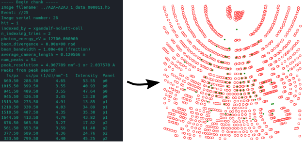

# crystfelparser



## Overview 
The crystfelparser application is an easy-to-use, open-source toolbox for parsing the output stream from indexamajig.
Basically, using this tool you can transform a raw text file into series of dictionaries, where for each frame you havea kewyword and the corresponding value, e.g. the strong reflections found by the spot finder and the positions of the predicted Bragg's reflections where the frames are indexable.

## Installation

Linux and MacOS are fully supported. Windows too, through WSL. 

### Installation via conda

We recommend and support installation via the [conda](https://docs.conda.io/en/latest/miniconda.html) package manager, and that a fresh environment is created beforehand. Then fetch the package from our channel:

```bash
conda install crystfelparser -c crystfelparser -c conda-forge
```

### Installation via Docker

A Dockerfile for manual builds is provided:

```bash
docker build -t crystfelparser . 
```

Attach to the provided container with:

```bash
docker run -it crystfelparser bash
```

You are now inside the container and you can use the script.

## Quick start: parsing the output stream of indexamajig

Usage from bash, as a script, is simple: just specify an input stream and (optional) an output file.

```bash
python crystfelparser.py --stream ../tutorials/example.stream
```

To import and use functions from the library in your code:


```python
from crystfelparser.crystfelparser import stream_to_dictionary

# parse a stream file
parsed=stream_to_dictionary("tutorials/example.stream")
len(parsed[25])
# Output: 13
```

## Tutorials

In-depth tutorials can be found in the `tutorials` subfolder. These include: 

- [something.ipynb](tutorials/something.ipynb): This showcases...
- [something_else.ipynb](tutorials/something_else.ipynb): This dives into...
